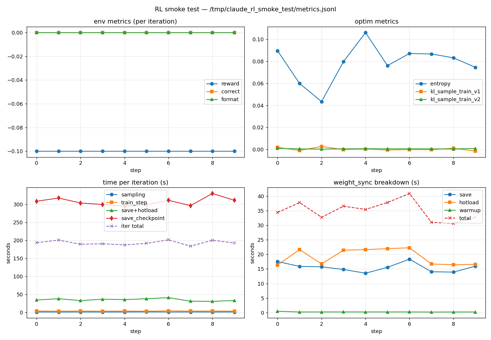

# RL Smoke — Experiment Log

End-to-end validation of `tinker_cookbook/rl/train.py` against the Firetitan
backend. A 10-iteration GRPO-style smoke test on real Fireworks
trainer + deployment infrastructure.

## Environment

- Model: `Qwen/Qwen3-4B` (full param, `lora_rank=0`)
- Training shape: `accounts/fireworks/trainingShapes/qwen3-4b-minimum`
  (1× B200, max ctx 4096) — note: the `accounts/pyroworks/` shapes did
  not have a deployment-shape that aligns with the deployment's
  hot-load bucket, so the run only worked with a `accounts/fireworks/`
  shape that ships a matching `rft-qwen3-4b-b200` deployment shape.
- Account: `pyroworks`
- Dataset: `Gsm8kDatasetBuilder(batch_size=2, group_size=2, ...)` from
  `tinker_cookbook/recipes/math_rl/math_env.py`
- Config knobs: `learning_rate=1e-5`, `max_tokens=128`, `max_steps=10`,
  `save_every=1`, `kl_penalty_coef=0`, `lora_rank=0`,
  `rollout_error_tolerance=True`, `num_groups_to_log=1`
- Driver scripts: `/tmp/rl_provision.py` (provisioning) and
  `/tmp/rl_smoke_test.py` (training entrypoint)

## Code under test (changes from baseline)

`tinker_cookbook/rl/train.py`:
- `save_checkpoint_and_get_sampling_client` was rewritten — the prior
  else-branch was a no-op statement (`await ..., metrics`) and
  `path_dict` was undefined. Now: optionally save a periodic DCP via
  `checkpoint_mgr.save_periodic_async(...)`, always
  `weight_syncer.save_and_hotload(f"step-{i_batch}")`, return
  `weight_syncer.get_deployment_sampler()` plus weight-sync timings.
- `do_async_training` initial sampler was `DeploymentSampler(config.model_name,)`
  (missing `inference_url`/`api_key`). Now reuses
  `weight_syncer.get_deployment_sampler()` if base weights have already
  been hot-loaded, otherwise uses the same save+hotload helper.
- `main()` resume + `load_checkpoint_path`: replaced calls to
  non-existent `service_client.create_training_client_from_state*_async`
  with `create_training_client(...)` followed by
  `await load_state_with_optimizer(...).result_async()`.
  `load_checkpoint_path` now raises (not supported on Firetitan).
- `WeightSyncer(lora_rank=config.lora_rank)` so LoRA runs force `base`
  checkpoint type (avoids serving-container crash on delta decompression).
- `start_batch` defaults to `0` when `resume_info.batch is None`.
- Removed a stray `print("training_logprobs_D: ...")` debug line.

## Run trace

Provisioned trainer + deployment in parallel:

- Trainer: `c0w0axfaonr00jhf` (`accounts/fireworks/trainingShapes/qwen3-4b-minimum`,
  full-param Qwen3-4B on B200) — READY in ~3 min.
- Deployment: `qwen3-4b-1777814935` (`rft-qwen3-4b-b200` shape), created with
  `hot_load_trainer_job` pointing at the trainer; bucket
  `gs://fireworks-artifacts-pyroworks-417e69/rl-checkpoints/pyroworks/trainer-c0w0axfaonr00jhf`
  auto-wired to the trainer.

First attempt used `accounts/pyroworks/trainingShapes/qwen3-4b-minimum-b200`
and the initial `weight_syncer.save_and_hotload("step-0-base")` failed
with `Hotload failed for 'step-0-base-...': deployment did not accept snapshot`.
Diagnosis: that pyroworks training shape's deployment-shape pairing did
not align the trainer's sampler-snapshot bucket with the deployment's
`hot_load_bucket_url`. Switching to the fireworks-account
`qwen3-4b-minimum` shape fixed it — the deployment then progressed
through `idle → downloading → loading → completed` and accepted the
snapshot in ~16 s.

Once provisioning aligned, the 10-step smoke ran cleanly:

1. Initial setup (~30 s warmup): `FiretitanServiceClient` →
   `create_training_client(base_model=..., lora_rank=0)` →
   `WeightSyncer(...)` detected stale `step-2-...` from a previous
   session and forced FULL hotload of fresh `step-0-base-d52f2f95`.
2. Loop (10× iterations):
   - Sample 2 prompt groups × 2 trajectories via `FireworksTokenCompleter`
     against the deployment.
   - `train_step(...)` with `loss_fn="importance_sampling"`.
   - DCP save via `checkpoint_mgr.save_periodic_async(...)`.
   - `weight_syncer.save_and_hotload(f"step-{i_batch}")` — DELTA hotload
     for iters 1+.
3. Final save + `Training completed successfully`.

`checkpoints.jsonl` after the run had 11 entries: `000001..000010`
(periodic) + `final`. All carry canonical `state_path: "step-1"` (see
caveat below).

Aggregate stats from `metrics.jsonl` (10 records, step 0..9):

| metric | mean | min | max |
|---|---|---|---|
| `time/total` (s/iter) | 193.0 | 183.7 | 201.4 |
| `time/sampling` | 0.97 | 0.83 | 1.19 |
| `time/train_step` | 3.50 | 3.11 | 4.09 |
| `time/save_and_hotload` | 34.97 | 30.59 | 40.87 |
| `time/save_checkpoint:total` (DCP) | 307.10 | 294.83 | 330.02 |
| `weight_sync/save_time_s` | 15.53 | 13.54 | 18.36 |
| `weight_sync/hotload_time_s` | 19.17 | 16.34 | 22.25 |
| `optim/entropy` | 0.0786 | 0.043 | 0.106 |
| `optim/kl_sample_train_v1` | 0.0003 | -0.0015 | 0.0028 |
| `env/all/reward/total` | -0.10 | -0.10 | -0.10 |

Sum of per-iteration `time/total`: 32.2 min.

`kl_sample_train_v1` near zero across all 10 iterations confirms the
**hotloaded sampler weights match the trainer's weights** end-to-end —
this is the real correctness check that the save+hotload chain wired
the deployment to the right policy. `optim/entropy` fluctuates in
0.04–0.11 (small-batch noise expected with 2×2 per iteration). Reward
stays at -0.10 because GSM8K with no learning at 10 steps emits the
default-fail reward; the smoke test is a system-level check, not a
fidelity check.

Plot of all key metrics: `rl_smoke_metrics.png` (generated by
`/tmp/plot_rl_metrics.py` from the run's `metrics.jsonl`).

## Caveat — same as SFT

The trainer's internal step counter resets each session unless you
resume into it, so all DCP saves in this run overwrote the same
canonical `step-1` (the "highest `step-N`" heuristic in
`checkpoint_utils.save_checkpoint_async` returns the same name when
the trainer doesn't increment). For *resume* this is fine — there's
one valid loadable canonical name; for a per-iteration audit trail
you'd need the cookbook's createTime-filtered control-plane lookup
(see `fireworks/cookbook/training/utils/checkpoints.py:_resolve_cp_name_after_save`).

## Cleanup

Trainer `c0w0axfaonr00jhf` deleted; deployment `qwen3-4b-1777814935`
in `DELETING`. The earlier failed attempt's resources
(`sqsfrag4w0odiw2f`, `qwen3-4b-1777813470`) were also cleaned up after
the bucket-alignment diagnosis.
