# SFT Sweep Results

Empirical hyperparameter sweep results for supervised fine-tuning (SFT).
Use these as a reference when choosing learning rate and LoRA rank for your model.

**Setup:**
- Dataset: tulu3
- Batch size: 128
- Training steps: 780
- Adapter: LoRA

> **Note:** Wall times are approximate and depend on server load at the time of the run. They may fluctuate significantly between runs.

## Key Findings

**Optimal learning rate is model-size dependent.** Across all models, the best LR per model breaks down as:

- `1e-04`: best for 1 model(s)
- `3e-04`: best for 14 model(s)
- `4e-04`: best for 2 model(s)
- `1e-03`: best for 10 model(s)

**Large models (small ranks 1–4) tend to prefer moderate LRs** (1e-4 to 3e-4), while **smaller models (ranks 64–128) can tolerate higher LRs** (3e-4 to 1e-3) and benefit from more LoRA capacity.

**Higher LoRA rank generally helps**, especially at higher learning rates. At very low LR (4e-5), rank differences are negligible. The benefit of higher rank becomes more pronounced as LR increases.

**Divergence:** 80 runs diverged (test NLL > 2.0), almost exclusively at `lr=3e-03` (72 of 80). This LR is too aggressive for most models with LoRA.

---

## Table of Contents

- [Qwen/Qwen3-235B-A22B-Instruct-2507](#qwen/qwen3-235b-a22b-instruct-2507)
- [Qwen/Qwen3-30B-A3B](#qwen/qwen3-30b-a3b)
- [Qwen/Qwen3-30B-A3B-Base](#qwen/qwen3-30b-a3b-base)
- [Qwen/Qwen3-30B-A3B-Instruct-2507](#qwen/qwen3-30b-a3b-instruct-2507)
- [Qwen/Qwen3-32B](#qwen/qwen3-32b)
- [Qwen/Qwen3-4B-Instruct-2507](#qwen/qwen3-4b-instruct-2507)
- [Qwen/Qwen3-8B](#qwen/qwen3-8b)
- [Qwen/Qwen3-8B-Base](#qwen/qwen3-8b-base)
- [Qwen/Qwen3-VL-235B-A22B-Instruct](#qwen/qwen3-vl-235b-a22b-instruct)
- [Qwen/Qwen3-VL-30B-A3B-Instruct](#qwen/qwen3-vl-30b-a3b-instruct)
- [Qwen/Qwen3.5-27B](#qwen/qwen3.5-27b)
- [Qwen/Qwen3.5-35B-A3B](#qwen/qwen3.5-35b-a3b)
- [Qwen/Qwen3.5-397B-A17B](#qwen/qwen3.5-397b-a17b)
- [Qwen/Qwen3.5-4B](#qwen/qwen3.5-4b)
- [deepseek-ai/DeepSeek-V3.1-Base](#deepseek-ai/deepseek-v3.1-base)
- [meta-llama/Llama-3.1-70B](#meta-llama/llama-3.1-70b)
- [meta-llama/Llama-3.1-8B](#meta-llama/llama-3.1-8b)
- [meta-llama/Llama-3.1-8B-Instruct](#meta-llama/llama-3.1-8b-instruct)
- [meta-llama/Llama-3.2-1B](#meta-llama/llama-3.2-1b)
- [meta-llama/Llama-3.2-3B](#meta-llama/llama-3.2-3b)
- [meta-llama/Llama-3.3-70B-Instruct](#meta-llama/llama-3.3-70b-instruct)
- [moonshotai/Kimi-K2-Thinking](#moonshotai/kimi-k2-thinking)
- [moonshotai/Kimi-K2.5](#moonshotai/kimi-k2.5)
- [nvidia/NVIDIA-Nemotron-3-Nano-30B-A3B-BF16](#nvidia/nvidia-nemotron-3-nano-30b-a3b-bf16)
- [nvidia/NVIDIA-Nemotron-3-Super-120B-A12B-BF16](#nvidia/nvidia-nemotron-3-super-120b-a12b-bf16)
- [openai/gpt-oss-120b](#openai/gpt-oss-120b)
- [openai/gpt-oss-20b](#openai/gpt-oss-20b)

---

## Qwen/Qwen3-235B-A22B-Instruct-2507

**Configuration:**
- Model: `Qwen/Qwen3-235B-A22B-Instruct-2507`
- Dataset: tulu3 (train split for training, test split for evaluation)
- Batch size: 128
- Learning rates: [4e-05, 1e-04, 3e-04, 1e-03, 3e-03]
- LoRA ranks: [1, 2, 4]
- Metric: `test/nll` — negative log-likelihood on held-out test split

<details>
<summary>Reproduce</summary>

```bash
uv run python -m tinker_cookbook.recipes.chat_sl.sweep \
    recipe=sft \
    base.model_name=Qwen/Qwen3-235B-A22B-Instruct-2507 \
    base.dataset=tulu3 \
    base.batch_size=128 \
    metric=test/nll \
    'learning_rates=[4e-05, 1e-04, 3e-04, 1e-03, 3e-03]' \
    'lora_ranks=[1, 2, 4]'
```

</details>

**Results:**

| LR | LoRA Rank | Test NLL | Train NLL | Wall Time (min) |
|---:|----------:|---------:|----------:|----------------:|
| 4e-05 | 1 | 0.4661 | 0.5136 | 237 |
| 4e-05 | 1 | 0.4665 | 0.5141 | 346 |
| 1e-04 | 1 | 0.4624 | 0.5112 | 235 |
| 3e-04 | 1 | 0.4615 | 0.5106 | 250 |
| 1e-03 | 1 | 0.4702 | 0.5227 | 269 |
| 4e-05 | 2 | 0.4665 | 0.5140 | 355 |
| 4e-05 | 2 | 0.4664 | 0.5138 | 255 |
| 1e-04 | 2 | 0.4618 | 0.5101 | 249 |
| 3e-04 | 2 | 0.4597 | 0.5092 | 225 |
| 1e-03 | 2 | 0.4677 | 0.5182 | 270 |
| 4e-05 | 4 | 0.4662 | 0.5135 | 216 |
| 4e-05 | 4 | 0.4663 | 0.5136 | 252 |
| 1e-04 | 4 | 0.4616 | 0.5103 | 271 |
| 3e-04 | 4 | 0.4589 | 0.5082 | 251 |
| 1e-03 | 4 | 0.4648 | 0.5159 | 282 |

**Best config:** rank=4, lr=3e-04, test_nll=0.4589

**Avg wall time per run:** 264 min

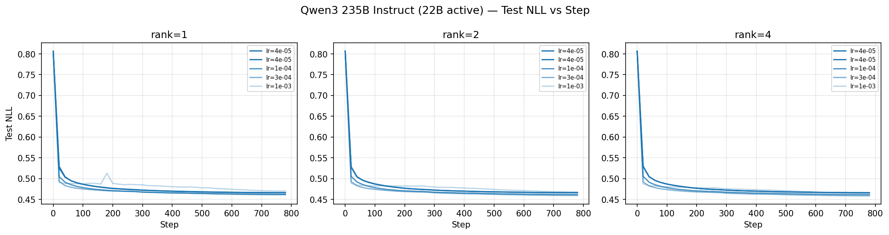

> **Note:** 3 run(s) diverged (test_nll > 2.0) at lr={3e-03} with rank={1, 2, 4} and are excluded from the table above.

---

## Qwen/Qwen3-30B-A3B

**Configuration:**
- Model: `Qwen/Qwen3-30B-A3B`
- Dataset: tulu3 (train split for training, test split for evaluation)
- Batch size: 128
- Learning rates: [4e-05, 1e-04, 3e-04, 1e-03, 3e-03]
- LoRA ranks: [1, 4, 16, 64]
- Metric: `test/nll` — negative log-likelihood on held-out test split

<details>
<summary>Reproduce</summary>

```bash
uv run python -m tinker_cookbook.recipes.chat_sl.sweep \
    recipe=sft \
    base.model_name=Qwen/Qwen3-30B-A3B \
    base.dataset=tulu3 \
    base.batch_size=128 \
    metric=test/nll \
    'learning_rates=[4e-05, 1e-04, 3e-04, 1e-03, 3e-03]' \
    'lora_ranks=[1, 4, 16, 64]'
```

</details>

**Results:**

| LR | LoRA Rank | Test NLL | Train NLL | Wall Time (min) |
|---:|----------:|---------:|----------:|----------------:|
| 4e-05 | 1 | 0.5312 | 0.5839 | 139 |
| 4e-05 | 1 | 0.5313 | 0.5840 | 151 |
| 1e-04 | 1 | 0.5247 | 0.5793 | 156 |
| 3e-04 | 1 | 0.5230 | 0.5790 | 127 |
| 1e-03 | 1 | 0.5265 | 0.5834 | 212 |
| 1e-03 | 1 | 0.5264 | 0.5832 | 233 |
| 4e-05 | 4 | 0.5312 | 0.5842 | 137 |
| 4e-05 | 4 | 0.5311 | 0.5843 | 154 |
| 1e-04 | 4 | 0.5235 | 0.5774 | 153 |
| 3e-04 | 4 | 0.5184 | 0.5734 | 151 |
| 1e-03 | 4 | 0.5201 | 0.5787 | 209 |
| 1e-03 | 4 | 0.5206 | 0.5778 | 232 |
| 3e-03 | 4 | 0.5550 | 0.6222 | 183 |
| 4e-05 | 16 | 0.5309 | 0.5838 | 139 |
| 4e-05 | 16 | 0.5311 | 0.5842 | 148 |
| 1e-04 | 16 | 0.5230 | 0.5763 | 122 |
| 3e-04 | 16 | 0.5171 | 0.5721 | 150 |
| 1e-03 | 16 | 0.5144 | 0.5738 | 205 |
| 1e-03 | 16 | 0.5150 | 0.5733 | 234 |
| 3e-03 | 16 | 0.5564 | 0.6283 | 131 |
| 3e-03 | 16 | 0.5630 | 0.6391 | 92 |
| 4e-05 | 64 | 0.5310 | 0.5839 | 154 |
| 1e-04 | 64 | 0.5231 | 0.5767 | 121 |
| 3e-04 | 64 | 0.5168 | 0.5715 | 154 |
| 1e-03 | 64 | 0.5128 | 0.5710 | 214 |
| 1e-03 | 64 | 0.5126 | 0.5706 | 184 |
| 3e-03 | 64 | 0.5428 | 0.6113 | 92 |

**Best config:** rank=64, lr=1e-03, test_nll=0.5126

**Avg wall time per run:** 162 min

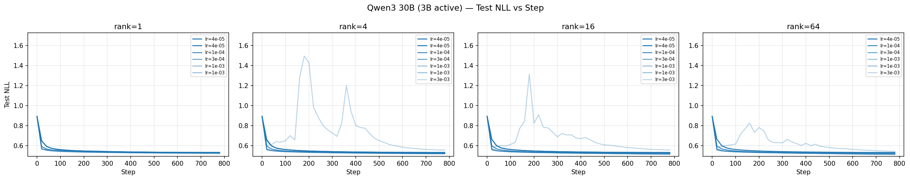

> **Note:** 4 run(s) diverged (test_nll > 2.0) at lr={3e-03} with rank={1, 4, 64} and are excluded from the table above.

---

## Qwen/Qwen3-30B-A3B-Base

**Configuration:**
- Model: `Qwen/Qwen3-30B-A3B-Base`
- Dataset: tulu3 (train split for training, test split for evaluation)
- Batch size: 128
- Learning rates: [4e-05, 1e-04, 3e-04, 1e-03, 3e-03]
- LoRA ranks: [1, 4, 16, 64]
- Metric: `test/nll` — negative log-likelihood on held-out test split

<details>
<summary>Reproduce</summary>

```bash
uv run python -m tinker_cookbook.recipes.chat_sl.sweep \
    recipe=sft \
    base.model_name=Qwen/Qwen3-30B-A3B-Base \
    base.dataset=tulu3 \
    base.batch_size=128 \
    metric=test/nll \
    'learning_rates=[4e-05, 1e-04, 3e-04, 1e-03, 3e-03]' \
    'lora_ranks=[1, 4, 16, 64]'
```

</details>

**Results:**

| LR | LoRA Rank | Test NLL | Train NLL | Wall Time (min) |
|---:|----------:|---------:|----------:|----------------:|
| 4e-05 | 1 | 0.5078 | 0.5526 | 104 |
| 4e-05 | 1 | 0.5082 | 0.5530 | 97 |
| 1e-04 | 1 | 0.5037 | 0.5492 | 92 |
| 3e-04 | 1 | 0.5028 | 0.5490 | 89 |
| 1e-03 | 1 | 0.5061 | 0.5551 | 93 |
| 4e-05 | 4 | 0.5075 | 0.5521 | 102 |
| 4e-05 | 4 | 0.5076 | 0.5523 | 95 |
| 1e-04 | 4 | 0.5025 | 0.5496 | 93 |
| 3e-04 | 4 | 0.4992 | 0.5473 | 95 |
| 1e-03 | 4 | 0.5027 | 0.5514 | 105 |
| 4e-05 | 16 | 0.5075 | 0.5521 | 63 |
| 4e-05 | 16 | 0.5075 | 0.5524 | 52 |
| 1e-04 | 16 | 0.5022 | 0.5485 | 51 |
| 3e-04 | 16 | 0.4984 | 0.5460 | 53 |
| 1e-03 | 16 | 0.4986 | 0.5489 | 91 |
| 3e-03 | 16 | 0.5471 | 0.6123 | 243 |
| 3e-03 | 16 | 0.5387 | 0.6007 | 276 |
| 4e-05 | 64 | 0.5074 | 0.5523 | 73 |
| 1e-04 | 64 | 0.5023 | 0.5490 | 54 |
| 3e-04 | 64 | 0.4983 | 0.5461 | 53 |
| 1e-03 | 64 | 0.4965 | 0.5474 | 69 |
| 3e-03 | 64 | 0.5289 | 0.5902 | 258 |
| 3e-03 | 64 | 0.5333 | 0.5965 | 265 |

**Best config:** rank=64, lr=1e-03, test_nll=0.4965

**Avg wall time per run:** 112 min

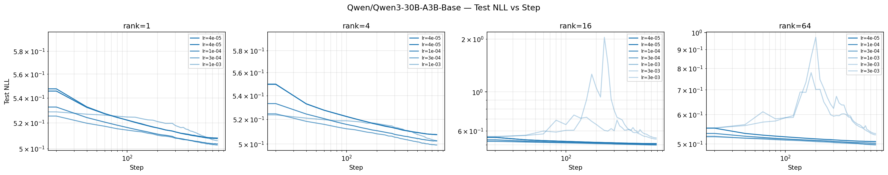

> **Note:** 2 run(s) diverged (test_nll > 2.0) at lr={3e-03} with rank={1, 4} and are excluded from the table above.

---

## Qwen/Qwen3-30B-A3B-Instruct-2507

**Configuration:**
- Model: `Qwen/Qwen3-30B-A3B-Instruct-2507`
- Dataset: tulu3 (train split for training, test split for evaluation)
- Batch size: 128
- Learning rates: [4e-05, 1e-04, 3e-04, 1e-03, 3e-03]
- LoRA ranks: [1, 4, 16, 64]
- Metric: `test/nll` — negative log-likelihood on held-out test split

<details>
<summary>Reproduce</summary>

```bash
uv run python -m tinker_cookbook.recipes.chat_sl.sweep \
    recipe=sft \
    base.model_name=Qwen/Qwen3-30B-A3B-Instruct-2507 \
    base.dataset=tulu3 \
    base.batch_size=128 \
    metric=test/nll \
    'learning_rates=[4e-05, 1e-04, 3e-04, 1e-03, 3e-03]' \
    'lora_ranks=[1, 4, 16, 64]'
```

</details>

**Results:**

| LR | LoRA Rank | Test NLL | Train NLL | Wall Time (min) |
|---:|----------:|---------:|----------:|----------------:|
| 4e-05 | 1 | 0.5156 | 0.5701 | 110 |
| 4e-05 | 1 | 0.5153 | 0.5703 | 146 |
| 1e-04 | 1 | 0.5103 | 0.5667 | 124 |
| 3e-04 | 1 | 0.5088 | 0.5647 | 105 |
| 1e-03 | 1 | 0.5127 | 0.5698 | 113 |
| 4e-05 | 4 | 0.5154 | 0.5700 | 133 |
| 4e-05 | 4 | 0.5154 | 0.5700 | 99 |
| 1e-04 | 4 | 0.5087 | 0.5646 | 93 |
| 3e-04 | 4 | 0.5047 | 0.5617 | 92 |
| 1e-03 | 4 | 0.5068 | 0.5658 | 117 |
| 4e-05 | 16 | 0.5156 | 0.5697 | 106 |
| 4e-05 | 16 | 0.5155 | 0.5695 | 97 |
| 1e-04 | 16 | 0.5084 | 0.5641 | 101 |
| 3e-04 | 16 | 0.5032 | 0.5599 | 68 |
| 1e-03 | 16 | 0.5029 | 0.5622 | 107 |
| 4e-05 | 64 | 0.5154 | 0.5696 | 127 |
| 1e-04 | 64 | 0.5083 | 0.5635 | 100 |
| 3e-04 | 64 | 0.5029 | 0.5591 | 75 |
| 1e-03 | 64 | 0.5004 | 0.5587 | 71 |

**Best config:** rank=64, lr=1e-03, test_nll=0.5004

**Avg wall time per run:** 104 min

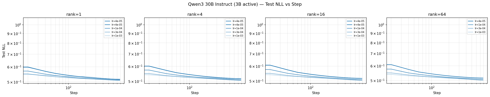

> **Note:** 4 run(s) diverged (test_nll > 2.0) at lr={3e-03} with rank={1, 4, 16, 64} and are excluded from the table above.

---

## Qwen/Qwen3-32B

**Configuration:**
- Model: `Qwen/Qwen3-32B`
- Dataset: tulu3 (train split for training, test split for evaluation)
- Batch size: 128
- Learning rates: [4e-05, 1e-04, 3e-04, 1e-03]
- LoRA ranks: [1, 4, 16, 64]
- Metric: `test/nll` — negative log-likelihood on held-out test split

<details>
<summary>Reproduce</summary>

```bash
uv run python -m tinker_cookbook.recipes.chat_sl.sweep \
    recipe=sft \
    base.model_name=Qwen/Qwen3-32B \
    base.dataset=tulu3 \
    base.batch_size=128 \
    metric=test/nll \
    'learning_rates=[4e-05, 1e-04, 3e-04, 1e-03]' \
    'lora_ranks=[1, 4, 16, 64]'
```

</details>

**Results:**

| LR | LoRA Rank | Test NLL | Train NLL | Wall Time (min) |
|---:|----------:|---------:|----------:|----------------:|
| 4e-05 | 1 | 0.5129 | 0.5669 | 129 |
| 4e-05 | 1 | 0.5130 | 0.5668 | 153 |
| 1e-04 | 1 | 0.5073 | 0.5622 | 140 |
| 3e-04 | 1 | 0.5043 | 0.5595 | 621 |
| 1e-03 | 1 | 0.5104 | 0.5707 | 750 |
| 4e-05 | 4 | 0.5124 | 0.5661 | 132 |
| 4e-05 | 4 | 0.5124 | 0.5659 | 90 |
| 1e-04 | 4 | 0.5061 | 0.5612 | 140 |
| 3e-04 | 4 | 0.5011 | 0.5567 | 752 |
| 4e-05 | 16 | 0.5123 | 0.5654 | 87 |
| 4e-05 | 16 | 0.5124 | 0.5660 | 156 |
| 1e-04 | 16 | 0.5058 | 0.5608 | 117 |
| 3e-04 | 16 | 0.4995 | 0.5559 | 731 |
| 4e-05 | 64 | 0.5124 | 0.5655 | 126 |
| 1e-04 | 64 | 0.5055 | 0.5604 | 602 |
| 3e-04 | 64 | 0.4990 | 0.5552 | 726 |

**Best config:** rank=64, lr=3e-04, test_nll=0.4990

**Avg wall time per run:** 341 min

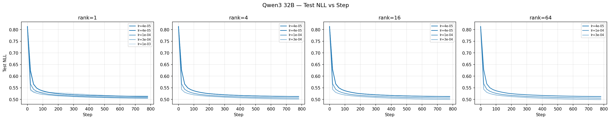

---

## Qwen/Qwen3-4B-Instruct-2507

**Configuration:**
- Model: `Qwen/Qwen3-4B-Instruct-2507`
- Dataset: tulu3 (train split for training, test split for evaluation)
- Batch size: 128
- Learning rates: [4e-05, 1e-04, 3e-04, 1e-03, 3e-03]
- LoRA ranks: [4, 16, 64, 128]
- Metric: `test/nll` — negative log-likelihood on held-out test split

<details>
<summary>Reproduce</summary>

```bash
uv run python -m tinker_cookbook.recipes.chat_sl.sweep \
    recipe=sft \
    base.model_name=Qwen/Qwen3-4B-Instruct-2507 \
    base.dataset=tulu3 \
    base.batch_size=128 \
    metric=test/nll \
    'learning_rates=[4e-05, 1e-04, 3e-04, 1e-03, 3e-03]' \
    'lora_ranks=[4, 16, 64, 128]'
```

</details>

**Results:**

| LR | LoRA Rank | Test NLL | Train NLL | Wall Time (min) |
|---:|----------:|---------:|----------:|----------------:|
| 4e-05 | 4 | 0.5818 | 0.6548 | 53 |
| 4e-05 | 4 | 0.5817 | 0.6545 | 45 |
| 1e-04 | 4 | 0.5737 | 0.6485 | 53 |
| 3e-04 | 4 | 0.5676 | 0.6438 | 50 |
| 1e-03 | 4 | 0.5702 | 0.6497 | 53 |
| 4e-05 | 16 | 0.5813 | 0.6540 | 48 |
| 4e-05 | 16 | 0.5815 | 0.6543 | 60 |
| 1e-04 | 16 | 0.5730 | 0.6478 | 50 |
| 3e-04 | 16 | 0.5651 | 0.6408 | 47 |
| 1e-03 | 16 | 0.5631 | 0.6426 | 53 |
| 4e-05 | 64 | 0.5815 | 0.6544 | 48 |
| 4e-05 | 64 | 0.5815 | 0.6541 | 61 |
| 1e-04 | 64 | 0.5725 | 0.6466 | 50 |
| 3e-04 | 64 | 0.5641 | 0.6397 | 59 |
| 1e-03 | 64 | 0.5596 | 0.6391 | 47 |
| 4e-05 | 128 | 0.5815 | 0.6541 | 54 |
| 1e-04 | 128 | 0.5725 | 0.6469 | 50 |
| 3e-04 | 128 | 0.5639 | 0.6398 | 58 |
| 1e-03 | 128 | 0.5588 | 0.6379 | 51 |

**Best config:** rank=128, lr=1e-03, test_nll=0.5588

**Avg wall time per run:** 52 min

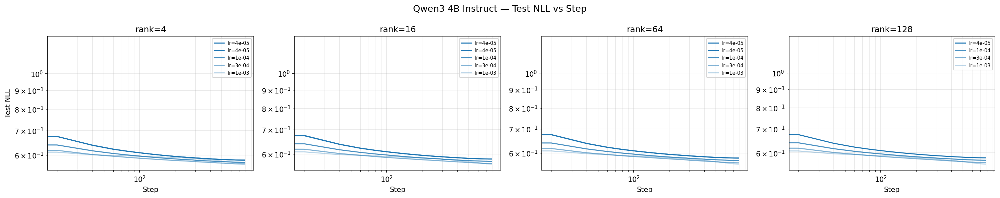

> **Note:** 4 run(s) diverged (test_nll > 2.0) at lr={3e-03} with rank={4, 16, 64, 128} and are excluded from the table above.

---

## Qwen/Qwen3-8B

**Configuration:**
- Model: `Qwen/Qwen3-8B`
- Dataset: tulu3 (train split for training, test split for evaluation)
- Batch size: 128
- Learning rates: [4e-05, 1e-04, 3e-04, 1e-03, 3e-03]
- LoRA ranks: [4, 16, 64, 128]
- Metric: `test/nll` — negative log-likelihood on held-out test split

<details>
<summary>Reproduce</summary>

```bash
uv run python -m tinker_cookbook.recipes.chat_sl.sweep \
    recipe=sft \
    base.model_name=Qwen/Qwen3-8B \
    base.dataset=tulu3 \
    base.batch_size=128 \
    metric=test/nll \
    'learning_rates=[4e-05, 1e-04, 3e-04, 1e-03, 3e-03]' \
    'lora_ranks=[4, 16, 64, 128]'
```

</details>

**Results:**

| LR | LoRA Rank | Test NLL | Train NLL | Wall Time (min) |
|---:|----------:|---------:|----------:|----------------:|
| 4e-05 | 4 | 0.5606 | 0.6214 | 76 |
| 4e-05 | 4 | 0.5606 | 0.6214 | 57 |
| 1e-04 | 4 | 0.5525 | 0.6148 | 62 |
| 3e-04 | 4 | 0.5458 | 0.6088 | 57 |
| 1e-03 | 4 | 0.5466 | 0.6131 | 76 |
| 4e-05 | 16 | 0.5605 | 0.6210 | 92 |
| 4e-05 | 16 | 0.5604 | 0.6213 | 55 |
| 1e-04 | 16 | 0.5520 | 0.6141 | 71 |
| 3e-04 | 16 | 0.5438 | 0.6065 | 52 |
| 1e-03 | 16 | 0.5405 | 0.6082 | 53 |
| 4e-05 | 64 | 0.5604 | 0.6209 | 93 |
| 4e-05 | 64 | 0.5604 | 0.6211 | 62 |
| 1e-04 | 64 | 0.5518 | 0.6138 | 83 |
| 3e-04 | 64 | 0.5433 | 0.6065 | 64 |
| 1e-03 | 64 | 0.5382 | 0.6040 | 71 |
| 4e-05 | 128 | 0.5603 | 0.6209 | 69 |
| 1e-04 | 128 | 0.5518 | 0.6136 | 88 |
| 3e-04 | 128 | 0.5433 | 0.6061 | 56 |
| 1e-03 | 128 | 0.5374 | 0.6027 | 71 |

**Best config:** rank=128, lr=1e-03, test_nll=0.5374

**Avg wall time per run:** 69 min

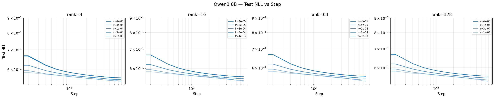

> **Note:** 4 run(s) diverged (test_nll > 2.0) at lr={3e-03} with rank={4, 16, 64, 128} and are excluded from the table above.

---

## Qwen/Qwen3-8B-Base

**Configuration:**
- Model: `Qwen/Qwen3-8B-Base`
- Dataset: tulu3 (train split for training, test split for evaluation)
- Batch size: 128
- Learning rates: [4e-05, 1e-04, 3e-04, 1e-03, 3e-03]
- LoRA ranks: [4, 16, 64, 128]
- Metric: `test/nll` — negative log-likelihood on held-out test split

<details>
<summary>Reproduce</summary>

```bash
uv run python -m tinker_cookbook.recipes.chat_sl.sweep \
    recipe=sft \
    base.model_name=Qwen/Qwen3-8B-Base \
    base.dataset=tulu3 \
    base.batch_size=128 \
    metric=test/nll \
    'learning_rates=[4e-05, 1e-04, 3e-04, 1e-03, 3e-03]' \
    'lora_ranks=[4, 16, 64, 128]'
```

</details>

**Results:**

| LR | LoRA Rank | Test NLL | Train NLL | Wall Time (min) |
|---:|----------:|---------:|----------:|----------------:|
| 4e-05 | 4 | 0.5320 | 0.5862 | 98 |
| 4e-05 | 4 | 0.5321 | 0.5864 | 90 |
| 1e-04 | 4 | 0.5271 | 0.5824 | 87 |
| 3e-04 | 4 | 0.5234 | 0.5794 | 82 |
| 1e-03 | 4 | 0.5261 | 0.5852 | 80 |
| 4e-05 | 16 | 0.5320 | 0.5864 | 95 |
| 4e-05 | 16 | 0.5320 | 0.5861 | 86 |
| 1e-04 | 16 | 0.5269 | 0.5823 | 89 |
| 3e-04 | 16 | 0.5222 | 0.5787 | 77 |
| 1e-03 | 16 | 0.5219 | 0.5820 | 82 |
| 4e-05 | 64 | 0.5321 | 0.5865 | 98 |
| 4e-05 | 64 | 0.5319 | 0.5863 | 88 |
| 1e-04 | 64 | 0.5268 | 0.5820 | 82 |
| 3e-04 | 64 | 0.5216 | 0.5781 | 83 |
| 1e-03 | 64 | 0.5195 | 0.5794 | 92 |
| 4e-05 | 128 | 0.5321 | 0.5862 | 89 |
| 1e-04 | 128 | 0.5267 | 0.5820 | 84 |
| 3e-04 | 128 | 0.5217 | 0.5780 | 87 |
| 1e-03 | 128 | 0.5189 | 0.5784 | 94 |

**Best config:** rank=128, lr=1e-03, test_nll=0.5189

**Avg wall time per run:** 87 min

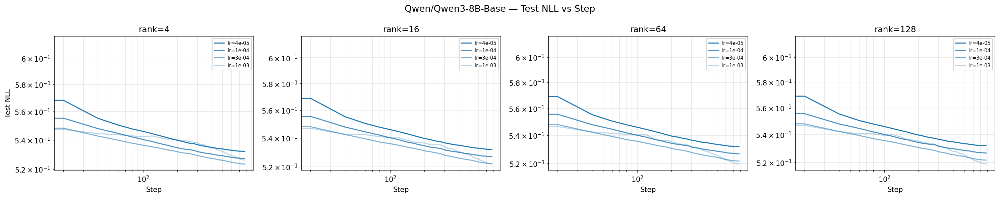

> **Note:** 4 run(s) diverged (test_nll > 2.0) at lr={3e-03} with rank={4, 16, 64, 128} and are excluded from the table above.

---

## Qwen/Qwen3-VL-235B-A22B-Instruct

**Configuration:**
- Model: `Qwen/Qwen3-VL-235B-A22B-Instruct`
- Dataset: tulu3 (train split for training, test split for evaluation)
- Batch size: 128
- Learning rates: [4e-05, 1e-04, 3e-04, 1e-03, 3e-03]
- LoRA ranks: [1, 2, 4]
- Metric: `test/nll` — negative log-likelihood on held-out test split

<details>
<summary>Reproduce</summary>

```bash
uv run python -m tinker_cookbook.recipes.chat_sl.sweep \
    recipe=sft \
    base.model_name=Qwen/Qwen3-VL-235B-A22B-Instruct \
    base.dataset=tulu3 \
    base.batch_size=128 \
    metric=test/nll \
    'learning_rates=[4e-05, 1e-04, 3e-04, 1e-03, 3e-03]' \
    'lora_ranks=[1, 2, 4]'
```

</details>

**Results:**

| LR | LoRA Rank | Test NLL | Train NLL | Wall Time (min) |
|---:|----------:|---------:|----------:|----------------:|
| 4e-05 | 1 | 0.4687 | 0.5199 | 315 |
| 1e-04 | 1 | 0.4645 | 0.5165 | 338 |
| 3e-04 | 1 | 0.4639 | 0.5166 | 314 |
| 1e-03 | 1 | 0.4733 | 0.5248 | 322 |
| 4e-05 | 2 | 0.4687 | 0.5199 | 316 |
| 1e-04 | 2 | 0.4637 | 0.5157 | 325 |
| 3e-04 | 2 | 0.4623 | 0.5147 | 317 |
| 1e-03 | 2 | 0.4703 | 0.5247 | 319 |
| 4e-05 | 4 | 0.4684 | 0.5197 | 321 |
| 1e-04 | 4 | 0.4639 | 0.5162 | 336 |
| 3e-04 | 4 | 0.4610 | 0.5137 | 312 |
| 1e-03 | 4 | 0.4668 | 0.5222 | 312 |

**Best config:** rank=4, lr=3e-04, test_nll=0.4610

**Avg wall time per run:** 321 min

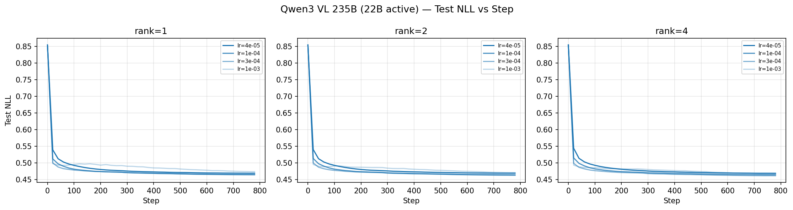

> **Note:** 3 run(s) diverged (test_nll > 2.0) at lr={3e-03} with rank={1, 2, 4} and are excluded from the table above.

---

## Qwen/Qwen3-VL-30B-A3B-Instruct

**Configuration:**
- Model: `Qwen/Qwen3-VL-30B-A3B-Instruct`
- Dataset: tulu3 (train split for training, test split for evaluation)
- Batch size: 128
- Learning rates: [4e-05, 1e-04, 3e-04, 1e-03, 3e-03]
- LoRA ranks: [1, 4, 16, 64]
- Metric: `test/nll` — negative log-likelihood on held-out test split

<details>
<summary>Reproduce</summary>

```bash
uv run python -m tinker_cookbook.recipes.chat_sl.sweep \
    recipe=sft \
    base.model_name=Qwen/Qwen3-VL-30B-A3B-Instruct \
    base.dataset=tulu3 \
    base.batch_size=128 \
    metric=test/nll \
    'learning_rates=[4e-05, 1e-04, 3e-04, 1e-03, 3e-03]' \
    'lora_ranks=[1, 4, 16, 64]'
```

</details>

**Results:**

| LR | LoRA Rank | Test NLL | Train NLL | Wall Time (min) |
|---:|----------:|---------:|----------:|----------------:|
| 4e-05 | 1 | 0.5094 | 0.5571 | 142 |
| 1e-04 | 1 | 0.5047 | 0.5547 | 141 |
| 3e-04 | 1 | 0.5044 | 0.5537 | 129 |
| 1e-03 | 1 | 0.5085 | 0.5592 | 164 |
| 4e-05 | 4 | 0.5083 | 0.5562 | 140 |
| 1e-04 | 4 | 0.5031 | 0.5520 | 139 |
| 3e-04 | 4 | 0.4997 | 0.5497 | 161 |
| 1e-03 | 4 | 0.5046 | 0.5567 | 164 |
| 3e-03 | 4 | 0.5726 | 0.6289 | 171 |
| 4e-05 | 16 | 0.5083 | 0.5562 | 142 |
| 1e-04 | 16 | 0.5022 | 0.5512 | 121 |
| 3e-04 | 16 | 0.4980 | 0.5473 | 157 |
| 1e-03 | 16 | 0.4994 | 0.5531 | 165 |
| 4e-05 | 64 | 0.5083 | 0.5560 | 139 |
| 1e-04 | 64 | 0.5022 | 0.5513 | 126 |
| 3e-04 | 64 | 0.4975 | 0.5474 | 157 |
| 1e-03 | 64 | 0.4971 | 0.5496 | 170 |

**Best config:** rank=64, lr=1e-03, test_nll=0.4971

**Avg wall time per run:** 149 min

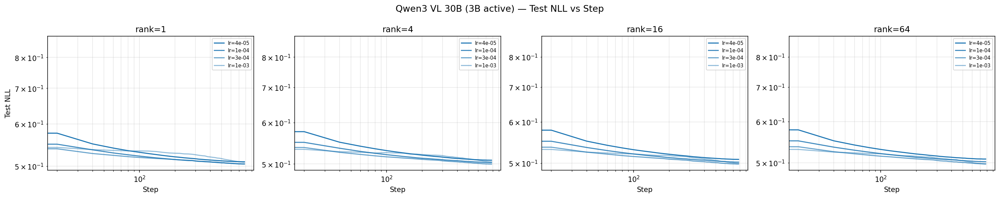

> **Note:** 3 run(s) diverged (test_nll > 2.0) at lr={3e-03} with rank={1, 16, 64} and are excluded from the table above.

---

## Qwen/Qwen3.5-27B

**Configuration:**
- Model: `Qwen/Qwen3.5-27B`
- Dataset: tulu3 (train split for training, test split for evaluation)
- Batch size: 128
- Learning rates: [4e-05, 1e-04, 3e-04, 1e-03, 3e-03]
- LoRA ranks: [1, 4, 16, 64]
- Metric: `test/nll` — negative log-likelihood on held-out test split

<details>
<summary>Reproduce</summary>

```bash
uv run python -m tinker_cookbook.recipes.chat_sl.sweep \
    recipe=sft \
    base.model_name=Qwen/Qwen3.5-27B \
    base.dataset=tulu3 \
    base.batch_size=128 \
    metric=test/nll \
    'learning_rates=[4e-05, 1e-04, 3e-04, 1e-03, 3e-03]' \
    'lora_ranks=[1, 4, 16, 64]'
```

</details>

**Results:**

| LR | LoRA Rank | Test NLL | Train NLL | Wall Time (min) |
|---:|----------:|---------:|----------:|----------------:|
| 4e-05 | 1 | 0.4774 | 0.5191 | 106 |
| 4e-05 | 1 | 0.4774 | 0.5191 | 118 |
| 1e-04 | 1 | 0.4745 | 0.5164 | 138 |
| 3e-04 | 1 | 0.4733 | 0.5165 | 91 |
| 1e-03 | 1 | 0.4829 | 0.5258 | 134 |
| 4e-05 | 4 | 0.4771 | 0.5186 | 134 |
| 4e-05 | 4 | 0.4769 | 0.5187 | 88 |
| 1e-04 | 4 | 0.4731 | 0.5154 | 137 |
| 3e-04 | 4 | 0.4701 | 0.5133 | 123 |
| 1e-03 | 4 | 0.4793 | 0.5260 | 136 |
| 4e-05 | 16 | 0.4770 | 0.5189 | 135 |
| 4e-05 | 16 | 0.4770 | 0.5189 | 120 |
| 1e-04 | 16 | 0.4728 | 0.5150 | 105 |
| 3e-04 | 16 | 0.4688 | 0.5119 | 103 |
| 1e-03 | 16 | 0.4738 | 0.5199 | 126 |
| 4e-05 | 64 | 0.4770 | 0.5185 | 128 |
| 1e-04 | 64 | 0.4727 | 0.5151 | 122 |
| 3e-04 | 64 | 0.4682 | 0.5118 | 114 |
| 1e-03 | 64 | 0.4704 | 0.5171 | 118 |

**Best config:** rank=64, lr=3e-04, test_nll=0.4682

**Avg wall time per run:** 120 min

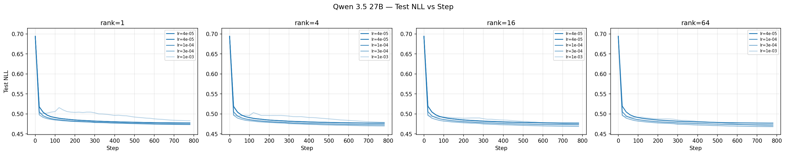

> **Note:** 4 run(s) diverged (test_nll > 2.0) at lr={3e-03} with rank={1, 4, 16, 64} and are excluded from the table above.

---

## Qwen/Qwen3.5-35B-A3B

**Configuration:**
- Model: `Qwen/Qwen3.5-35B-A3B`
- Dataset: tulu3 (train split for training, test split for evaluation)
- Batch size: 128
- Learning rates: [4e-05, 1e-04, 3e-04, 1e-03, 3e-03]
- LoRA ranks: [1, 4, 16, 64]
- Metric: `test/nll` — negative log-likelihood on held-out test split

<details>
<summary>Reproduce</summary>

```bash
uv run python -m tinker_cookbook.recipes.chat_sl.sweep \
    recipe=sft \
    base.model_name=Qwen/Qwen3.5-35B-A3B \
    base.dataset=tulu3 \
    base.batch_size=128 \
    metric=test/nll \
    'learning_rates=[4e-05, 1e-04, 3e-04, 1e-03, 3e-03]' \
    'lora_ranks=[1, 4, 16, 64]'
```

</details>

**Results:**

| LR | LoRA Rank | Test NLL | Train NLL | Wall Time (min) |
|---:|----------:|---------:|----------:|----------------:|
| 4e-05 | 1 | 0.4923 | 0.5305 | 145 |
| 4e-05 | 1 | 0.4926 | 0.5308 | 136 |
| 1e-04 | 1 | 0.4900 | 0.5288 | 125 |
| 3e-04 | 1 | 0.4906 | 0.5309 | 127 |
| 1e-03 | 1 | 0.4951 | 0.5365 | 133 |
| 4e-05 | 4 | 0.4917 | 0.5296 | 132 |
| 4e-05 | 4 | 0.4917 | 0.5298 | 134 |
| 1e-04 | 4 | 0.4879 | 0.5265 | 125 |
| 3e-04 | 4 | 0.4856 | 0.5251 | 135 |
| 1e-03 | 4 | 0.4928 | 0.5330 | 120 |
| 4e-05 | 16 | 0.4916 | 0.5290 | 73 |
| 4e-05 | 16 | 0.4917 | 0.5295 | 53 |
| 1e-04 | 16 | 0.4873 | 0.5257 | 51 |
| 3e-04 | 16 | 0.4835 | 0.5226 | 47 |
| 1e-03 | 16 | 0.4875 | 0.5303 | 47 |
| 4e-05 | 64 | 0.4916 | 0.5296 | 49 |
| 1e-04 | 64 | 0.4872 | 0.5252 | 54 |
| 3e-04 | 64 | 0.4827 | 0.5226 | 78 |
| 1e-03 | 64 | 0.4841 | 0.5264 | 99 |

**Best config:** rank=64, lr=3e-04, test_nll=0.4827

**Avg wall time per run:** 98 min

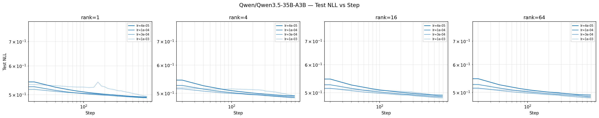

> **Note:** 4 run(s) diverged (test_nll > 2.0) at lr={3e-03} with rank={1, 4, 16, 64} and are excluded from the table above.

---

## Qwen/Qwen3.5-397B-A17B

**Configuration:**
- Model: `Qwen/Qwen3.5-397B-A17B`
- Dataset: tulu3 (train split for training, test split for evaluation)
- Batch size: 128
- Learning rates: [4e-05, 1e-04, 3e-04, 1e-03, 3e-03]
- LoRA ranks: [1, 2, 4]
- Metric: `test/nll` — negative log-likelihood on held-out test split

<details>
<summary>Reproduce</summary>

```bash
uv run python -m tinker_cookbook.recipes.chat_sl.sweep \
    recipe=sft \
    base.model_name=Qwen/Qwen3.5-397B-A17B \
    base.dataset=tulu3 \
    base.batch_size=128 \
    metric=test/nll \
    'learning_rates=[4e-05, 1e-04, 3e-04, 1e-03, 3e-03]' \
    'lora_ranks=[1, 2, 4]'
```

</details>

**Results:**

| LR | LoRA Rank | Test NLL | Train NLL | Wall Time (min) |
|---:|----------:|---------:|----------:|----------------:|
| 4e-05 | 1 | 0.4467 | 0.4788 | 369 |
| 4e-05 | 1 | 0.4466 | 0.4793 | 362 |
| 1e-04 | 1 | 0.4444 | 0.4772 | 378 |
| 3e-04 | 1 | 0.4447 | 0.4789 | 356 |
| 1e-03 | 1 | 0.4538 | 0.4874 | 363 |
| 4e-05 | 2 | 0.4465 | 0.4791 | 303 |
| 4e-05 | 2 | 0.4464 | 0.4789 | 361 |
| 1e-04 | 2 | 0.4440 | 0.4768 | 374 |
| 3e-04 | 2 | 0.4431 | 0.4761 | 359 |
| 1e-03 | 2 | 0.4516 | 0.4873 | 802 |
| 4e-05 | 4 | 0.4464 | 0.4792 | 367 |
| 4e-05 | 4 | 0.4464 | 0.4793 | 312 |
| 1e-04 | 4 | 0.4438 | 0.4765 | 358 |
| 3e-04 | 4 | 0.4419 | 0.4745 | 361 |
| 1e-03 | 4 | 0.4589 | 0.4969 | 362 |

**Best config:** rank=4, lr=3e-04, test_nll=0.4419

**Avg wall time per run:** 386 min

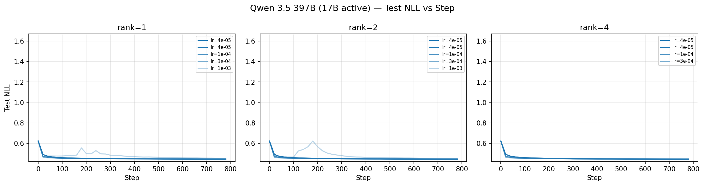

> **Note:** 3 run(s) diverged (test_nll > 2.0) at lr={3e-03} with rank={1, 2, 4} and are excluded from the table above.

---

## Qwen/Qwen3.5-4B

**Configuration:**
- Model: `Qwen/Qwen3.5-4B`
- Dataset: tulu3 (train split for training, test split for evaluation)
- Batch size: 128
- Learning rates: [4e-05, 1e-04, 3e-04, 1e-03, 3e-03]
- LoRA ranks: [4, 16, 64, 128]
- Metric: `test/nll` — negative log-likelihood on held-out test split

<details>
<summary>Reproduce</summary>

```bash
uv run python -m tinker_cookbook.recipes.chat_sl.sweep \
    recipe=sft \
    base.model_name=Qwen/Qwen3.5-4B \
    base.dataset=tulu3 \
    base.batch_size=128 \
    metric=test/nll \
    'learning_rates=[4e-05, 1e-04, 3e-04, 1e-03, 3e-03]' \
    'lora_ranks=[4, 16, 64, 128]'
```

</details>

**Results:**

| LR | LoRA Rank | Test NLL | Train NLL | Wall Time (min) |
|---:|----------:|---------:|----------:|----------------:|
| 4e-05 | 4 | 0.5553 | 0.6004 | 57 |
| 4e-05 | 4 | 0.5552 | 0.6003 | 86 |
| 1e-04 | 4 | 0.5498 | 0.5961 | 74 |
| 3e-04 | 4 | 0.5467 | 0.5945 | 62 |
| 1e-03 | 4 | 0.5551 | 0.6071 | 65 |
| 4e-05 | 16 | 0.5547 | 0.5998 | 58 |
| 4e-05 | 16 | 0.5547 | 0.5997 | 85 |
| 1e-04 | 16 | 0.5483 | 0.5938 | 71 |
| 3e-04 | 16 | 0.5424 | 0.5893 | 58 |
| 1e-03 | 16 | 0.5498 | 0.6041 | 64 |
| 4e-05 | 64 | 0.5545 | 0.5992 | 57 |
| 4e-05 | 64 | 0.5548 | 0.5997 | 85 |
| 1e-04 | 64 | 0.5478 | 0.5932 | 61 |
| 3e-04 | 64 | 0.5406 | 0.5879 | 58 |
| 1e-03 | 64 | 0.5438 | 0.5955 | 63 |
| 4e-05 | 128 | 0.5546 | 0.5994 | 73 |
| 1e-04 | 128 | 0.5477 | 0.5932 | 62 |
| 3e-04 | 128 | 0.5402 | 0.5869 | 56 |
| 1e-03 | 128 | 0.5420 | 0.5948 | 59 |

**Best config:** rank=128, lr=3e-04, test_nll=0.5402

**Avg wall time per run:** 66 min

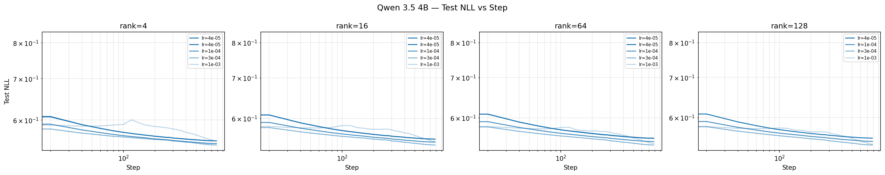

> **Note:** 4 run(s) diverged (test_nll > 2.0) at lr={3e-03} with rank={4, 16, 64, 128} and are excluded from the table above.

---

## deepseek-ai/DeepSeek-V3.1-Base

**Configuration:**
- Model: `deepseek-ai/DeepSeek-V3.1-Base`
- Dataset: tulu3 (train split for training, test split for evaluation)
- Batch size: 128
- Learning rates: [4e-05, 1e-04, 2e-04, 4e-04, 1e-03]
- LoRA ranks: [1, 2, 4]
- Metric: `test/nll` — negative log-likelihood on held-out test split

<details>
<summary>Reproduce</summary>

```bash
uv run python -m tinker_cookbook.recipes.chat_sl.sweep \
    recipe=sft \
    base.model_name=deepseek-ai/DeepSeek-V3.1-Base \
    base.dataset=tulu3 \
    base.batch_size=128 \
    metric=test/nll \
    'learning_rates=[4e-05, 1e-04, 2e-04, 4e-04, 1e-03]' \
    'lora_ranks=[1, 2, 4]'
```

</details>

**Results:**

| LR | LoRA Rank | Test NLL | Train NLL | Wall Time (min) |
|---:|----------:|---------:|----------:|----------------:|
| 1e-04 | 1 | 0.4853 | 0.5137 | 557 |
| 1e-03 | 1 | 0.4955 | 0.5252 | 557 |
| 4e-05 | 2 | 0.4886 | 0.5160 | 571 |
| 2e-04 | 2 | 0.4835 | 0.5127 | 566 |
| 4e-04 | 2 | 0.4842 | 0.5132 | 550 |
| 1e-03 | 2 | 0.4938 | 0.5246 | 566 |
| 4e-05 | 4 | 0.4881 | 0.5159 | 561 |
| 1e-04 | 4 | 0.4848 | 0.5137 | 560 |
| 4e-04 | 4 | 0.4826 | 0.5128 | 566 |
| 1e-03 | 4 | 0.4904 | 0.5221 | 546 |

**Best config:** rank=4, lr=4e-04, test_nll=0.4826

**Avg wall time per run:** 560 min

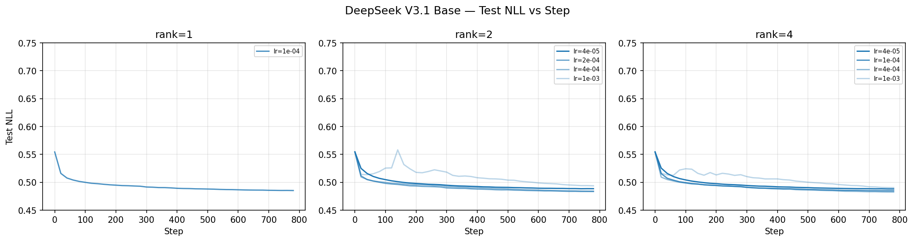

---

## meta-llama/Llama-3.1-70B

**Configuration:**
- Model: `meta-llama/Llama-3.1-70B`
- Dataset: tulu3 (train split for training, test split for evaluation)
- Batch size: 128
- Learning rates: [4e-05, 1e-04, 3e-04, 1e-03, 3e-03]
- LoRA ranks: [1, 2, 4]
- Metric: `test/nll` — negative log-likelihood on held-out test split

<details>
<summary>Reproduce</summary>

```bash
uv run python -m tinker_cookbook.recipes.chat_sl.sweep \
    recipe=sft \
    base.model_name=meta-llama/Llama-3.1-70B \
    base.dataset=tulu3 \
    base.batch_size=128 \
    metric=test/nll \
    'learning_rates=[4e-05, 1e-04, 3e-04, 1e-03, 3e-03]' \
    'lora_ranks=[1, 2, 4]'
```

</details>

**Results:**

| LR | LoRA Rank | Test NLL | Train NLL | Wall Time (min) |
|---:|----------:|---------:|----------:|----------------:|
| 4e-05 | 1 | 0.5131 | 0.5552 | 344 |
| 4e-05 | 1 | 0.5131 | 0.5557 | 331 |
| 1e-04 | 1 | 0.5064 | 0.5500 | 352 |
| 3e-04 | 1 | 0.5045 | 0.5486 | 340 |
| 4e-05 | 2 | 0.5123 | 0.5552 | 335 |
| 4e-05 | 2 | 0.5125 | 0.5549 | 344 |
| 1e-04 | 2 | 0.5053 | 0.5496 | 357 |
| 3e-04 | 2 | 0.5015 | 0.5464 | 337 |
| 4e-05 | 4 | 0.5121 | 0.5551 | 336 |
| 4e-05 | 4 | 0.5120 | 0.5548 | 342 |
| 1e-04 | 4 | 0.5047 | 0.5487 | 368 |
| 3e-04 | 4 | 0.4997 | 0.5454 | 330 |

**Best config:** rank=4, lr=3e-04, test_nll=0.4997

**Avg wall time per run:** 343 min

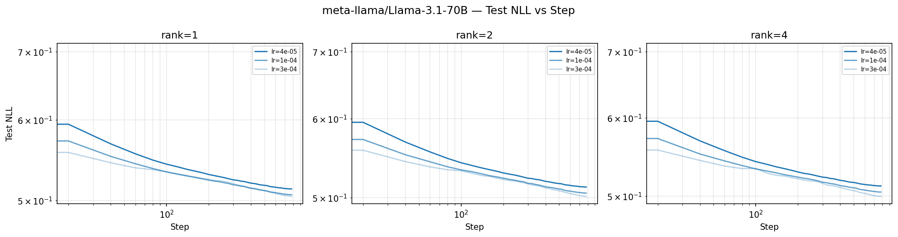

> **Note:** 6 run(s) diverged (test_nll > 2.0) at lr={1e-03, 3e-03} with rank={1, 2, 4} and are excluded from the table above.

---

## meta-llama/Llama-3.1-8B

**Configuration:**
- Model: `meta-llama/Llama-3.1-8B`
- Dataset: tulu3 (train split for training, test split for evaluation)
- Batch size: 128
- Learning rates: [4e-05, 1e-04, 3e-04, 1e-03, 3e-03]
- LoRA ranks: [4, 16, 64, 128]
- Metric: `test/nll` — negative log-likelihood on held-out test split

<details>
<summary>Reproduce</summary>

```bash
uv run python -m tinker_cookbook.recipes.chat_sl.sweep \
    recipe=sft \
    base.model_name=meta-llama/Llama-3.1-8B \
    base.dataset=tulu3 \
    base.batch_size=128 \
    metric=test/nll \
    'learning_rates=[4e-05, 1e-04, 3e-04, 1e-03, 3e-03]' \
    'lora_ranks=[4, 16, 64, 128]'
```

</details>

**Results:**

| LR | LoRA Rank | Test NLL | Train NLL | Wall Time (min) |
|---:|----------:|---------:|----------:|----------------:|
| 4e-05 | 4 | 0.6121 | 0.6622 | 89 |
| 4e-05 | 4 | 0.6120 | 0.6617 | 87 |
| 1e-04 | 4 | 0.6005 | 0.6512 | 79 |
| 3e-04 | 4 | 0.5925 | 0.6440 | 83 |
| 1e-03 | 4 | 0.6021 | 0.6611 | 96 |
| 4e-05 | 16 | 0.6114 | 0.6619 | 88 |
| 4e-05 | 16 | 0.6112 | 0.6612 | 83 |
| 1e-04 | 16 | 0.5983 | 0.6494 | 86 |
| 3e-04 | 16 | 0.5863 | 0.6388 | 82 |
| 1e-03 | 16 | 0.5931 | 0.6525 | 94 |
| 4e-05 | 64 | 0.6110 | 0.6609 | 90 |
| 4e-05 | 64 | 0.6110 | 0.6610 | 81 |
| 1e-04 | 64 | 0.5977 | 0.6485 | 83 |
| 3e-04 | 64 | 0.5839 | 0.6373 | 82 |
| 1e-03 | 64 | 0.5839 | 0.6424 | 95 |
| 4e-05 | 128 | 0.6109 | 0.6609 | 84 |
| 1e-04 | 128 | 0.5976 | 0.6484 | 89 |
| 3e-04 | 128 | 0.5834 | 0.6371 | 83 |
| 1e-03 | 128 | 0.5847 | 0.6413 | 86 |

**Best config:** rank=128, lr=3e-04, test_nll=0.5834

**Avg wall time per run:** 86 min

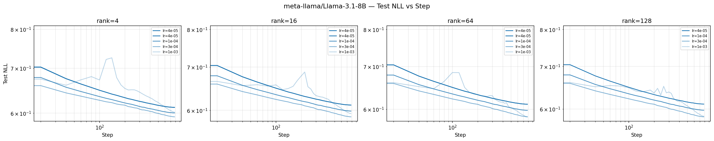

> **Note:** 4 run(s) diverged (test_nll > 2.0) at lr={3e-03} with rank={4, 16, 64, 128} and are excluded from the table above.

---

## meta-llama/Llama-3.1-8B-Instruct

**Configuration:**
- Model: `meta-llama/Llama-3.1-8B-Instruct`
- Dataset: tulu3 (train split for training, test split for evaluation)
- Batch size: 128
- Learning rates: [4e-05, 1e-04, 3e-04, 1e-03, 3e-03]
- LoRA ranks: [4, 16, 64, 128]
- Metric: `test/nll` — negative log-likelihood on held-out test split

<details>
<summary>Reproduce</summary>

```bash
uv run python -m tinker_cookbook.recipes.chat_sl.sweep \
    recipe=sft \
    base.model_name=meta-llama/Llama-3.1-8B-Instruct \
    base.dataset=tulu3 \
    base.batch_size=128 \
    metric=test/nll \
    'learning_rates=[4e-05, 1e-04, 3e-04, 1e-03, 3e-03]' \
    'lora_ranks=[4, 16, 64, 128]'
```

</details>

**Results:**

| LR | LoRA Rank | Test NLL | Train NLL | Wall Time (min) |
|---:|----------:|---------:|----------:|----------------:|
| 4e-05 | 4 | 0.5939 | 0.6515 | 54 |
| 4e-05 | 4 | 0.5941 | 0.6517 | 54 |
| 1e-04 | 4 | 0.5851 | 0.6435 | 74 |
| 3e-04 | 4 | 0.5792 | 0.6409 | 67 |
| 1e-03 | 4 | 0.5867 | 0.6527 | 51 |
| 4e-05 | 16 | 0.5933 | 0.6510 | 54 |
| 4e-05 | 16 | 0.5933 | 0.6508 | 51 |
| 1e-04 | 16 | 0.5837 | 0.6417 | 50 |
| 3e-04 | 16 | 0.5750 | 0.6349 | 49 |
| 1e-03 | 16 | 0.5809 | 0.6483 | 63 |
| 4e-05 | 64 | 0.5931 | 0.6507 | 55 |
| 4e-05 | 64 | 0.5932 | 0.6509 | 51 |
| 1e-04 | 64 | 0.5830 | 0.6408 | 49 |
| 3e-04 | 64 | 0.5730 | 0.6327 | 66 |
| 1e-03 | 64 | 0.5756 | 0.6423 | 50 |
| 4e-05 | 128 | 0.5932 | 0.6509 | 75 |
| 1e-04 | 128 | 0.5828 | 0.6409 | 68 |
| 3e-04 | 128 | 0.5727 | 0.6328 | 69 |
| 1e-03 | 128 | 0.5743 | 0.6390 | 64 |

**Best config:** rank=128, lr=3e-04, test_nll=0.5727

**Avg wall time per run:** 59 min

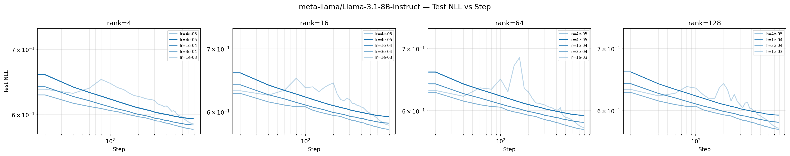

> **Note:** 4 run(s) diverged (test_nll > 2.0) at lr={3e-03} with rank={4, 16, 64, 128} and are excluded from the table above.

---

## meta-llama/Llama-3.2-1B

**Configuration:**
- Model: `meta-llama/Llama-3.2-1B`
- Dataset: tulu3 (train split for training, test split for evaluation)
- Batch size: 128
- Learning rates: [4e-05, 1e-04, 3e-04, 1e-03, 3e-03]
- LoRA ranks: [4, 16, 64, 128]
- Metric: `test/nll` — negative log-likelihood on held-out test split

<details>
<summary>Reproduce</summary>

```bash
uv run python -m tinker_cookbook.recipes.chat_sl.sweep \
    recipe=sft \
    base.model_name=meta-llama/Llama-3.2-1B \
    base.dataset=tulu3 \
    base.batch_size=128 \
    metric=test/nll \
    'learning_rates=[4e-05, 1e-04, 3e-04, 1e-03, 3e-03]' \
    'lora_ranks=[4, 16, 64, 128]'
```

</details>

**Results:**

| LR | LoRA Rank | Test NLL | Train NLL | Wall Time (min) |
|---:|----------:|---------:|----------:|----------------:|
| 4e-05 | 4 | 0.8565 | 0.9285 | 42 |
| 4e-05 | 4 | 0.8562 | 0.9285 | 42 |
| 1e-04 | 4 | 0.8355 | 0.9102 | 42 |
| 3e-04 | 4 | 0.8192 | 0.8974 | 44 |
| 1e-03 | 4 | 0.8162 | 0.8958 | 42 |
| 4e-05 | 16 | 0.8540 | 0.9262 | 42 |
| 4e-05 | 16 | 0.8540 | 0.9259 | 42 |
| 1e-04 | 16 | 0.8297 | 0.9051 | 42 |
| 3e-04 | 16 | 0.8038 | 0.8841 | 43 |
| 1e-03 | 16 | 0.7948 | 0.8800 | 42 |
| 4e-05 | 64 | 0.8532 | 0.9251 | 43 |
| 4e-05 | 64 | 0.8533 | 0.9251 | 43 |
| 1e-04 | 64 | 0.8275 | 0.9029 | 41 |
| 3e-04 | 64 | 0.7978 | 0.8768 | 42 |
| 1e-03 | 64 | 0.7802 | 0.8656 | 44 |
| 4e-05 | 128 | 0.8532 | 0.9251 | 45 |
| 1e-04 | 128 | 0.8271 | 0.9027 | 44 |
| 3e-04 | 128 | 0.7966 | 0.8759 | 43 |
| 1e-03 | 128 | 0.7763 | 0.8600 | 47 |

**Best config:** rank=128, lr=1e-03, test_nll=0.7763

**Avg wall time per run:** 43 min

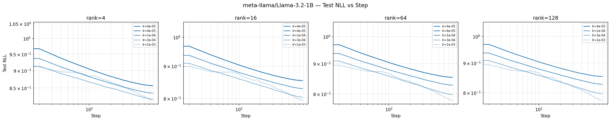

> **Note:** 4 run(s) diverged (test_nll > 2.0) at lr={3e-03} with rank={4, 16, 64, 128} and are excluded from the table above.

---

## meta-llama/Llama-3.2-3B

**Configuration:**
- Model: `meta-llama/Llama-3.2-3B`
- Dataset: tulu3 (train split for training, test split for evaluation)
- Batch size: 128
- Learning rates: [4e-05, 1e-04, 3e-04, 1e-03, 3e-03]
- LoRA ranks: [4, 16, 64, 128]
- Metric: `test/nll` — negative log-likelihood on held-out test split

<details>
<summary>Reproduce</summary>

```bash
uv run python -m tinker_cookbook.recipes.chat_sl.sweep \
    recipe=sft \
    base.model_name=meta-llama/Llama-3.2-3B \
    base.dataset=tulu3 \
    base.batch_size=128 \
    metric=test/nll \
    'learning_rates=[4e-05, 1e-04, 3e-04, 1e-03, 3e-03]' \
    'lora_ranks=[4, 16, 64, 128]'
```

</details>

**Results:**

| LR | LoRA Rank | Test NLL | Train NLL | Wall Time (min) |
|---:|----------:|---------:|----------:|----------------:|
| 4e-05 | 4 | 0.7131 | 0.7728 | 65 |
| 4e-05 | 4 | 0.7132 | 0.7738 | 62 |
| 1e-04 | 4 | 0.6966 | 0.7577 | 60 |
| 3e-04 | 4 | 0.6819 | 0.7458 | 60 |
| 1e-03 | 4 | 0.6808 | 0.7502 | 59 |
| 4e-05 | 16 | 0.7121 | 0.7720 | 67 |
| 4e-05 | 16 | 0.7120 | 0.7722 | 59 |
| 1e-04 | 16 | 0.6936 | 0.7550 | 63 |
| 3e-04 | 16 | 0.6737 | 0.7380 | 57 |
| 1e-03 | 16 | 0.6661 | 0.7371 | 57 |
| 4e-05 | 64 | 0.7119 | 0.7717 | 67 |
| 4e-05 | 64 | 0.7119 | 0.7719 | 60 |
| 1e-04 | 64 | 0.6927 | 0.7542 | 58 |
| 3e-04 | 64 | 0.6710 | 0.7355 | 59 |
| 1e-03 | 64 | 0.6580 | 0.7269 | 62 |
| 4e-05 | 128 | 0.7119 | 0.7716 | 64 |
| 1e-04 | 128 | 0.6925 | 0.7544 | 61 |
| 3e-04 | 128 | 0.6706 | 0.7353 | 59 |
| 1e-03 | 128 | 0.6559 | 0.7245 | 58 |

**Best config:** rank=128, lr=1e-03, test_nll=0.6559

**Avg wall time per run:** 61 min

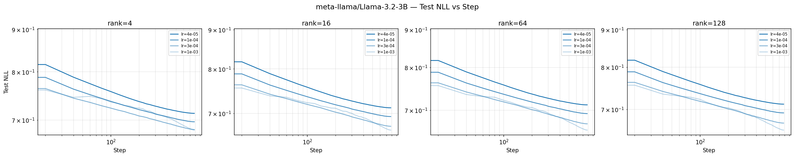

> **Note:** 4 run(s) diverged (test_nll > 2.0) at lr={3e-03} with rank={4, 16, 64, 128} and are excluded from the table above.

---

## meta-llama/Llama-3.3-70B-Instruct

**Configuration:**
- Model: `meta-llama/Llama-3.3-70B-Instruct`
- Dataset: tulu3 (train split for training, test split for evaluation)
- Batch size: 128
- Learning rates: [4e-05, 1e-04, 3e-04]
- LoRA ranks: [1, 2, 4]
- Metric: `test/nll` — negative log-likelihood on held-out test split

<details>
<summary>Reproduce</summary>

```bash
uv run python -m tinker_cookbook.recipes.chat_sl.sweep \
    recipe=sft \
    base.model_name=meta-llama/Llama-3.3-70B-Instruct \
    base.dataset=tulu3 \
    base.batch_size=128 \
    metric=test/nll \
    'learning_rates=[4e-05, 1e-04, 3e-04]' \
    'lora_ranks=[1, 2, 4]'
```

</details>

**Results:**

| LR | LoRA Rank | Test NLL | Train NLL | Wall Time (min) |
|---:|----------:|---------:|----------:|----------------:|
| 4e-05 | 1 | 0.5160 | 0.5632 | 599 |
| 1e-04 | 1 | 0.5095 | 0.5585 | 487 |
| 3e-04 | 1 | 0.5068 | 0.5562 | 566 |
| 4e-05 | 2 | 0.5158 | 0.5632 | 589 |
| 1e-04 | 2 | 0.5078 | 0.5564 | 502 |
| 3e-04 | 2 | 0.5042 | 0.5548 | 548 |
| 4e-05 | 4 | 0.5153 | 0.5630 | 570 |
| 1e-04 | 4 | 0.5076 | 0.5560 | 508 |
| 3e-04 | 4 | 0.5021 | 0.5526 | 560 |

**Best config:** rank=4, lr=3e-04, test_nll=0.5021

**Avg wall time per run:** 548 min

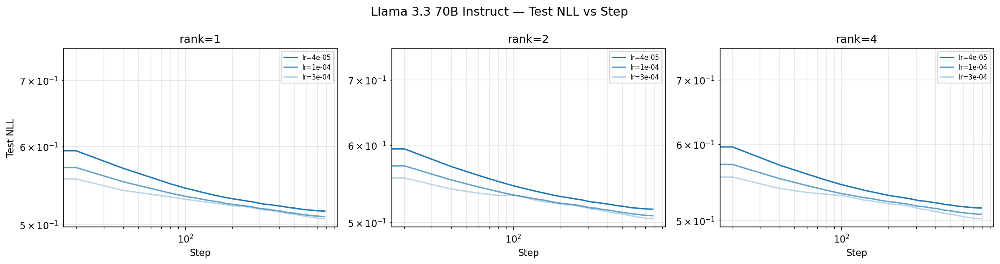

---

## moonshotai/Kimi-K2-Thinking

**Configuration:**
- Model: `moonshotai/Kimi-K2-Thinking`
- Dataset: tulu3 (train split for training, test split for evaluation)
- Batch size: 128
- Learning rates: [4e-05, 1e-04, 3e-04, 1e-03, 3e-03]
- LoRA ranks: [1, 2, 4]
- Metric: `test/nll` — negative log-likelihood on held-out test split

<details>
<summary>Reproduce</summary>

```bash
uv run python -m tinker_cookbook.recipes.chat_sl.sweep \
    recipe=sft \
    base.model_name=moonshotai/Kimi-K2-Thinking \
    base.dataset=tulu3 \
    base.batch_size=128 \
    metric=test/nll \
    'learning_rates=[4e-05, 1e-04, 3e-04, 1e-03, 3e-03]' \
    'lora_ranks=[1, 2, 4]'
```

</details>

**Results:**

| LR | LoRA Rank | Test NLL | Train NLL | Wall Time (min) |
|---:|----------:|---------:|----------:|----------------:|
| 4e-05 | 1 | 0.4760 | 0.5058 | 505 |
| 4e-05 | 1 | 0.4760 | 0.5060 | 407 |
| 1e-04 | 1 | 0.4729 | 0.5041 | 549 |
| 1e-03 | 1 | 0.4778 | 0.5111 | 579 |
| 4e-05 | 2 | 0.4759 | 0.5056 | 531 |
| 4e-05 | 2 | 0.4760 | 0.5055 | 512 |
| 3e-04 | 2 | 0.4710 | 0.5029 | 580 |
| 1e-03 | 2 | 0.4761 | 0.5081 | 593 |
| 4e-05 | 4 | 0.4761 | 0.5053 | 529 |
| 4e-05 | 4 | 0.4760 | 0.5051 | 513 |
| 3e-04 | 4 | 0.4707 | 0.5020 | 584 |
| 1e-03 | 4 | 0.4741 | 0.5067 | 525 |

**Best config:** rank=4, lr=3e-04, test_nll=0.4707

**Avg wall time per run:** 534 min

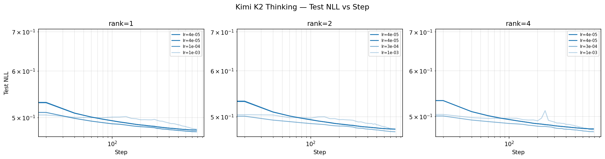

> **Note:** 3 run(s) diverged (test_nll > 2.0) at lr={3e-03} with rank={1, 2, 4} and are excluded from the table above.

---

## moonshotai/Kimi-K2.5

**Configuration:**
- Model: `moonshotai/Kimi-K2.5`
- Dataset: tulu3 (train split for training, test split for evaluation)
- Batch size: 128
- Learning rates: [4e-05, 1e-04, 3e-04, 1e-03, 3e-03]
- LoRA ranks: [1, 2, 4]
- Metric: `test/nll` — negative log-likelihood on held-out test split

<details>
<summary>Reproduce</summary>

```bash
uv run python -m tinker_cookbook.recipes.chat_sl.sweep \
    recipe=sft \
    base.model_name=moonshotai/Kimi-K2.5 \
    base.dataset=tulu3 \
    base.batch_size=128 \
    metric=test/nll \
    'learning_rates=[4e-05, 1e-04, 3e-04, 1e-03, 3e-03]' \
    'lora_ranks=[1, 2, 4]'
```

</details>

**Results:**

| LR | LoRA Rank | Test NLL | Train NLL | Wall Time (min) |
|---:|----------:|---------:|----------:|----------------:|
| 4e-05 | 1 | 0.4668 | 0.4920 | 421 |
| 4e-05 | 1 | 0.4669 | 0.4919 | 616 |
| 1e-03 | 1 | 0.4766 | 0.5050 | 699 |
| 4e-05 | 2 | 0.4667 | 0.4910 | 421 |
| 4e-05 | 2 | 0.4669 | 0.4918 | 486 |
| 1e-04 | 2 | 0.4649 | 0.4908 | 539 |
| 1e-03 | 2 | 0.4736 | 0.5025 | 697 |
| 4e-05 | 4 | 0.4667 | 0.4915 | 437 |
| 4e-05 | 4 | 0.4666 | 0.4915 | 623 |
| 1e-04 | 4 | 0.4645 | 0.4899 | 531 |
| 3e-04 | 4 | 0.4634 | 0.4907 | 653 |
| 1e-03 | 4 | 0.4696 | 0.4980 | 703 |

**Best config:** rank=4, lr=3e-04, test_nll=0.4634

**Avg wall time per run:** 569 min

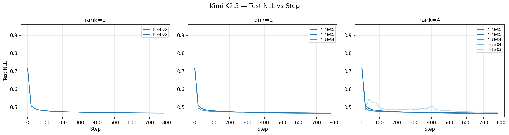

> **Note:** 3 run(s) diverged (test_nll > 2.0) at lr={3e-03} with rank={1, 2, 4} and are excluded from the table above.

---

## nvidia/NVIDIA-Nemotron-3-Nano-30B-A3B-BF16

**Configuration:**
- Model: `nvidia/NVIDIA-Nemotron-3-Nano-30B-A3B-BF16`
- Dataset: tulu3 (train split for training, test split for evaluation)
- Batch size: 128
- Learning rates: [4e-05, 1e-04, 2e-04, 4e-04, 2e-03, 4e-03]
- LoRA ranks: [1, 4, 16, 64]
- Metric: `test/nll` — negative log-likelihood on held-out test split

<details>
<summary>Reproduce</summary>

```bash
uv run python -m tinker_cookbook.recipes.chat_sl.sweep \
    recipe=sft \
    base.model_name=nvidia/NVIDIA-Nemotron-3-Nano-30B-A3B-BF16 \
    base.dataset=tulu3 \
    base.batch_size=128 \
    metric=test/nll \
    'learning_rates=[4e-05, 1e-04, 2e-04, 4e-04, 2e-03, 4e-03]' \
    'lora_ranks=[1, 4, 16, 64]'
```

</details>

**Results:**

| LR | LoRA Rank | Test NLL | Train NLL | Wall Time (min) |
|---:|----------:|---------:|----------:|----------------:|
| 4e-05 | 1 | 0.5656 | 0.6359 | 161 |
| 1e-04 | 1 | 0.5573 | 0.6288 | 159 |
| 2e-04 | 1 | 0.5546 | 0.6273 | 162 |
| 4e-04 | 1 | 0.5540 | 0.6275 | 161 |
| 4e-05 | 4 | 0.5649 | 0.6357 | 157 |
| 1e-04 | 4 | 0.5555 | 0.6274 | 162 |
| 2e-04 | 4 | 0.5515 | 0.6235 | 154 |
| 4e-04 | 4 | 0.5482 | 0.6228 | 161 |
| 4e-05 | 16 | 0.5647 | 0.6345 | 161 |
| 1e-04 | 16 | 0.5551 | 0.6273 | 152 |
| 4e-04 | 16 | 0.5455 | 0.6190 | 158 |
| 2e-03 | 16 | 0.5532 | 0.6329 | 160 |
| 4e-05 | 64 | 0.5649 | 0.6353 | 161 |
| 2e-04 | 64 | 0.5501 | 0.6219 | 162 |
| 4e-04 | 64 | 0.5449 | 0.6181 | 158 |
| 2e-03 | 64 | 0.5469 | 0.6240 | 67 |

**Best config:** rank=64, lr=4e-04, test_nll=0.5449

**Avg wall time per run:** 153 min

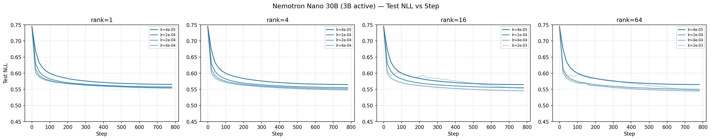

> **Note:** 5 run(s) diverged (test_nll > 2.0) at lr={2e-03, 4e-03} with rank={1, 4, 16, 64} and are excluded from the table above.

---

## nvidia/NVIDIA-Nemotron-3-Super-120B-A12B-BF16

**Configuration:**
- Model: `nvidia/NVIDIA-Nemotron-3-Super-120B-A12B-BF16`
- Dataset: tulu3 (train split for training, test split for evaluation)
- Batch size: 128
- Learning rates: [4e-05, 1e-04, 2e-04, 4e-04, 1e-03]
- LoRA ranks: [1, 4, 16, 64]
- Metric: `test/nll` — negative log-likelihood on held-out test split

<details>
<summary>Reproduce</summary>

```bash
uv run python -m tinker_cookbook.recipes.chat_sl.sweep \
    recipe=sft \
    base.model_name=nvidia/NVIDIA-Nemotron-3-Super-120B-A12B-BF16 \
    base.dataset=tulu3 \
    base.batch_size=128 \
    metric=test/nll \
    'learning_rates=[4e-05, 1e-04, 2e-04, 4e-04, 1e-03]' \
    'lora_ranks=[1, 4, 16, 64]'
```

</details>

**Results:**

| LR | LoRA Rank | Test NLL | Train NLL | Wall Time (min) |
|---:|----------:|---------:|----------:|----------------:|
| 4e-04 | 1 | 0.4835 | 0.5401 | 155 |
| 4e-05 | 4 | 0.4899 | 0.5395 | 151 |
| 2e-04 | 4 | 0.4808 | 0.5354 | 153 |
| 4e-05 | 16 | 0.4900 | 0.5401 | 156 |
| 1e-04 | 16 | 0.4832 | 0.5353 | 155 |
| 2e-04 | 16 | 0.4802 | 0.5345 | 152 |
| 4e-04 | 16 | 0.4783 | 0.5334 | 152 |
| 2e-04 | 64 | 0.4799 | 0.5341 | 155 |
| 4e-04 | 64 | 0.4776 | 0.5330 | 150 |
| 1e-03 | 64 | 0.4767 | 0.5348 | 152 |

**Best config:** rank=64, lr=1e-03, test_nll=0.4767

**Avg wall time per run:** 153 min

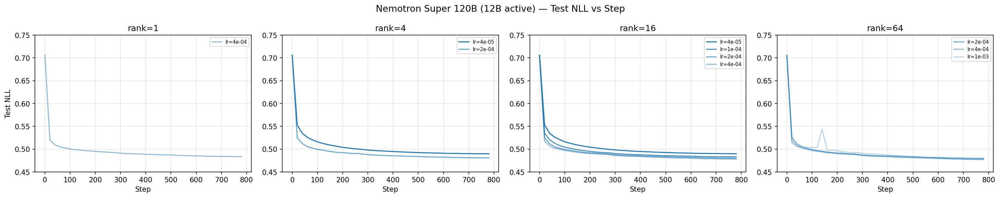

---

## openai/gpt-oss-120b

**Configuration:**
- Model: `openai/gpt-oss-120b`
- Dataset: tulu3 (train split for training, test split for evaluation)
- Batch size: 128
- Learning rates: [4e-05, 1e-04, 3e-04, 1e-03, 3e-03]
- LoRA ranks: [1, 4, 16]
- Metric: `test/nll` — negative log-likelihood on held-out test split

<details>
<summary>Reproduce</summary>

```bash
uv run python -m tinker_cookbook.recipes.chat_sl.sweep \
    recipe=sft \
    base.model_name=openai/gpt-oss-120b \
    base.dataset=tulu3 \
    base.batch_size=128 \
    metric=test/nll \
    'learning_rates=[4e-05, 1e-04, 3e-04, 1e-03, 3e-03]' \
    'lora_ranks=[1, 4, 16]'
```

</details>

**Results:**

| LR | LoRA Rank | Test NLL | Train NLL | Wall Time (min) |
|---:|----------:|---------:|----------:|----------------:|
| 4e-05 | 1 | 0.5142 | 0.5497 | 150 |
| 1e-04 | 1 | 0.5092 | 0.5446 | 122 |
| 1e-03 | 1 | 0.5111 | 0.5483 | 121 |
| 4e-05 | 4 | 0.5131 | 0.5474 | 120 |
| 1e-04 | 4 | 0.5076 | 0.5439 | 149 |
| 3e-04 | 4 | 0.5048 | 0.5418 | 119 |
| 1e-03 | 4 | 0.5086 | 0.5452 | 148 |
| 3e-03 | 4 | 1.7223 | 1.8536 | 133 |
| 4e-05 | 16 | 0.5129 | 0.5469 | 57 |
| 3e-04 | 16 | 0.5032 | 0.5400 | 113 |
| 1e-03 | 16 | 0.5053 | 0.5434 | 49 |
| 3e-03 | 16 | 0.5477 | 0.5878 | 77 |

**Best config:** rank=16, lr=3e-04, test_nll=0.5032

**Avg wall time per run:** 113 min

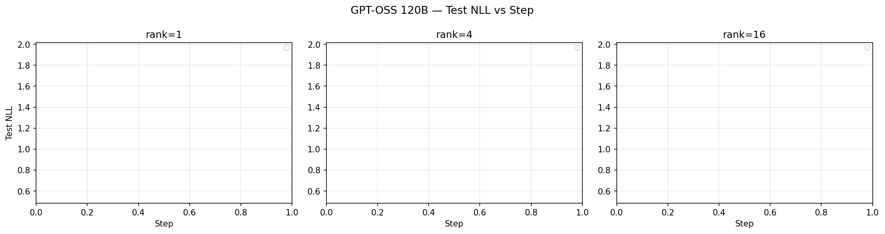

> **Note:** 1 run(s) diverged (test_nll > 2.0) at lr={3e-03} with rank={1} and are excluded from the table above.

---

## openai/gpt-oss-20b

**Configuration:**
- Model: `openai/gpt-oss-20b`
- Dataset: tulu3 (train split for training, test split for evaluation)
- Batch size: 128
- Learning rates: [4e-05, 1e-04]
- LoRA ranks: [4, 16]
- Metric: `test/nll` — negative log-likelihood on held-out test split

<details>
<summary>Reproduce</summary>

```bash
uv run python -m tinker_cookbook.recipes.chat_sl.sweep \
    recipe=sft \
    base.model_name=openai/gpt-oss-20b \
    base.dataset=tulu3 \
    base.batch_size=128 \
    metric=test/nll \
    'learning_rates=[4e-05, 1e-04]' \
    'lora_ranks=[4, 16]'
```

</details>

**Results:**

| LR | LoRA Rank | Test NLL | Train NLL | Wall Time (min) |
|---:|----------:|---------:|----------:|----------------:|
| 4e-05 | 4 | 0.5474 | 0.5830 | 67 |
| 4e-05 | 4 | 0.5480 | 0.5836 | 49 |
| 1e-04 | 4 | 0.5431 | 0.5790 | 53 |
| 4e-05 | 16 | 0.5473 | 0.5828 | 54 |
| 4e-05 | 16 | 0.5473 | 0.5830 | 34 |
| 1e-04 | 16 | 0.5420 | 0.5779 | 34 |

**Best config:** rank=16, lr=1e-04, test_nll=0.5420

**Avg wall time per run:** 49 min

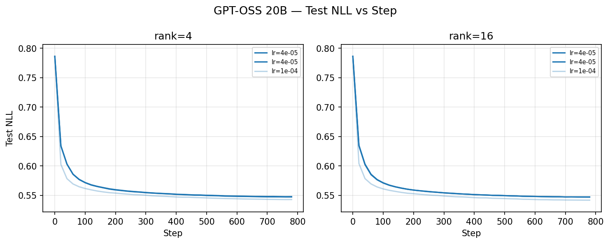

---
