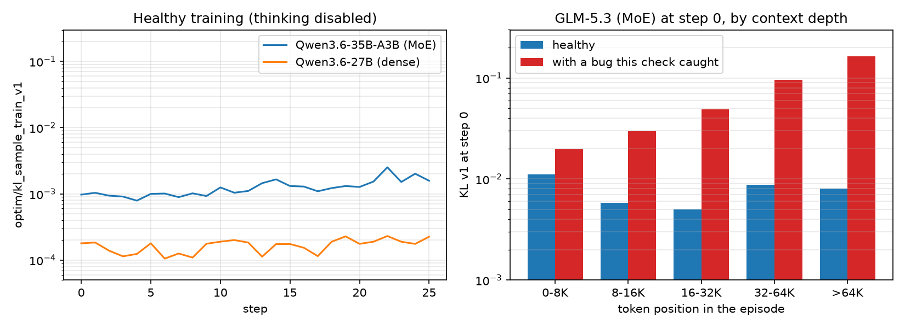

# RL Numerics Check

This is a check of RL training numerics, not a recipe for a real task. The task and its data
are synthetic, built only to produce many turns and long sequences, and designed so that rewards
before training never saturate.

### What to look for

The RL training loop logs `optim/kl_sample_train_v1` and `optim/kl_sample_train_v2` every step.
`kl_sample_train_v1` is the mean, over generated tokens, of the log-probability the sampler
assigned to each token minus the log-probability the trainer computes for it: a first-order
estimate of the KL between the sampler and the trainer. `kl_sample_train_v2` is half the mean
squared difference.



`kl_sample_train` depends on the model, and `kl_sample_train_v1` is typically ~10x higher for
MoE models compared to dense models. For example, in our healthy training runs, we observed
`kl_sample_train_v1` for Qwen3.6-35B-A3B around 0.001-0.002 and Qwen3.6-27B around 0.0002.

In one long-context related bug this check caught, GLM-5.3's `kl_sample_train_v1` at step 0 was
about 0.09, rising from 0.02 in the first 8K tokens to 0.16 past 64K. On the healthy trainer it
was under 0.011 at every depth.

### The task

A many-turn tool-use environment. The model reads a document one page per turn with a
`read_page` tool and reports how many times a word appears in it.

- Each problem is a document of N pages. Pages are consecutive windows of WikiText-103, so
  the counts come from natural English text.
- The model calls `read_page(page)` once per turn. Extra calls in the same turn are rejected
  with an error, so reading N pages takes N turns.
- The model finishes by replying without a tool call and ending with `Answer: <count>`.
- Matching is case-insensitive over whole words, where a word is a maximal run of letters.
- The reward is `max(0, 1 - |predicted - true| / (tolerance * true))`: 1 for the exact count,
  falling to 0 at a relative error of `task.reward_tolerance` (default 0.2). A missing answer
  gets 0. Gold counts are typically 25-110 and depend mostly on the word, so with a tolerance
  of 1.0, answering a typical count for the word without reading already scores about 0.8.

With the defaults (28-36 pages of 10,000 characters), a document is about 62K-80K tokens for
GLM-5.3 and Qwen3.6, and an episode takes 29-37 turns.

### Recommended setup

Use the defaults: the prompt states the word and the number of pages, so nothing is hidden and
the model only has to read every page and count. Rewards still start low, because counting a word
across 30+ pages is hard, and climb steadily with training, so the check covers many real policy
updates. The healthy curves above used 8 groups of 8 rollouts per step:

```bash
python -m tinker_cookbook.recipes.rl_numerics_check.train \
    model_name=Qwen/Qwen3.6-35B-A3B:peft:262144 \
    renderer_name=qwen3_5_disable_thinking \
    group_size=8 groups_per_batch=8
```

### Parameterizing turns and context length

Depending on the model and what you want to check, you may want more or fewer turns, or a
shorter or longer context. These are controlled by:

- `task.num_pages_min` and `task.num_pages_max`: the number of pages in each document, sampled
  per problem. The model reads one page per turn, so this sets the number of turns (an episode
  may run up to `num_pages_max + 4` turns).
- `task.page_chars`: the length of each page, and so of each `read_page` result. 10,000
  characters is about 2.2K tokens for GLM-5.3 and Qwen3.6.
- `max_trajectory_tokens` (default 128K): the most tokens an episode may reach. Keep it above
  the document length plus the tokens the model generates; an episode that exceeds it ends with a reward of -0.1.
- `max_tokens` (default 1024): the most tokens the model may generate per turn.

For example, `task.num_pages_min=96 task.num_pages_max=100 task.page_chars=2000` gives about 100
turns over roughly 45K tokens, and `task.page_chars=20000` with the default page counts gives
documents of about 125K-160K tokens, which needs a larger `max_trajectory_tokens`.

### Parameterizing difficulty

The difficulty of what the model has to learn can also be set, e.g. to make sure the model
doesn't start in a regime where it is already saturated and has nothing to learn. Two options
control how much of the problem the prompt reveals:

- `task.num_pages_hint` sets what the prompt says about the length of the document.
  - `exact` (default): the prompt states the number of pages, which is sampled per problem
    from `[num_pages_min, num_pages_max]`. Nothing has to be learned.
  - `range`: the prompt states only the range. Every problem has the same hidden number of
    pages, which the model has to learn.
- `task.word_hint` sets what the prompt says about the word to count. The word of each problem
  is sampled from `task.words`, by default 28 common words with distinct first and last letters.
  - `exact` (default): the prompt states the word. Nothing has to be learned.
  - `first_last`: the prompt states only the word's first and last letters. The model has to
    learn which word in `task.words` each letter pair stands for.
  - `hidden`: the prompt says nothing about the word. `task.words` must hold a single word,
    which the model has to learn.

The hidden page count and hidden words are fixed across problems, so training on them teaches
the model those particular values. It does not learn a skill that carries over to a different N
or word list.

`task.words` sets how many words there are to learn, e.g. `task.words=until` for one word or
`task.words=until,after,during` for three. With `first_last`, no two words may share first and
last letters; `hidden` needs a single word.

With `num_pages_hint=range`, pages past the end of the document still return text, so the model
gets no signal about where the document ends except through the reward. The hidden N is a fixed
draw from the range unless set with `task.secret_num_pages`.

We tried three settings with Qwen3.6-35B-A3B and Qwen3.6-27B, thinking disabled, and saw these
learning patterns:

- Nothing hidden (the defaults): reward climbs steadily, from near zero to above 0.9 in about
  35 steps on the 35B model.
- Hidden page count (`task.num_pages_hint=range`): reward climbs slowly and had not saturated
  after 75 steps.
- One hidden word (`task.word_hint=first_last task.words=until`): reward stays flat until the
  model finds the word, then climbs to above 0.9.

### Thinking

With thinking enabled, `max_tokens` has to cover the reasoning as well as the answer. On
Qwen3.6-35B-A3B, the final answer turn took a median of about 2.6K-3.7K tokens and up to about
8K before training. At `max_tokens=1024` about 80% of answers were cut off, and with a hidden page
count the model learned to stop answering. Use `max_tokens=8192`, and raise
`max_trajectory_tokens`, since the reasoning kept in the history grows the context over 30+ turns:

```bash
python -m tinker_cookbook.recipes.rl_numerics_check.train \
    model_name=Qwen/Qwen3.6-35B-A3B:peft:262144 \
    renderer_name=qwen3_5_preserve_thinking \
    max_tokens=8192 max_trajectory_tokens=196608
```

`qwen3_5_preserve_thinking` keeps earlier reasoning in the history, so a turn that reasons merges
into the same sequence as the next; `qwen3_5` strips it. A turn with no reasoning does not merge,
because history tokenizes its empty think block differently from how it was sampled;
`env/all/extension_rate` shows how often this happens.

### Appendix

#### Metrics

Besides `env/all/reward/total`, the reward function logs `exact_match`, `answer_parsed`,
`abs_error`, `true_count`, `num_pages`, `pages_read`, `read_all_pages`, `read_past_end`,
`rejected_tool_calls`, and `invalid_page_requests`. With a hidden page count, `read_all_pages`
and `read_past_end` show whether the model is learning N; `abs_error` then shows whether it
counts correctly. `extension_rate` is the fraction of turns whose next observation extends the
previous observation and action; see Renderers.

#### Renderers

Each episode trains as a single sequence only if the renderer has the sequence extension
property for tool-calling turns. `qwen3_5_disable_thinking` and the GLM-5.3 renderers do, and
`qwen3_5_preserve_thinking` does for turns that reason (see Thinking). With `renderer_name` unset,
Qwen3.5 and Qwen3.6 use their recommended `qwen3_5` renderer, which strips earlier reasoning
from the history, so each turn of a 30+ turn episode becomes its own long training sequence.
`env/all/extension_rate` shows this directly (1.0 when every turn merges), and the recipe logs a
warning when most turns of an episode fail to extend.
